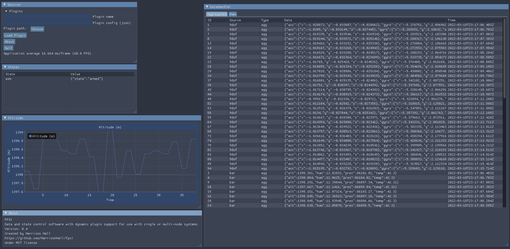

# FPSI
FPSI is a system designed primarily for handling local data systems managed by
multiple nodes. The core program contains a system for data collection, data
filtering, managing states, and communication. A plugin framework is also
provided (and strictly necessary for nontrivial usage) so that users can
dynamically modify and add features to FPSI.



FPSI was designed abstract so I could use it for a couple of personal projects.
It is hard to know just what FPSI can be used for without an example. When one
of my projects are sufficiently developed I will link it here.

## Running
### Installation
```bash
# Pull submodules
git submodule update --init --recursive --depth 1

# Build yaml-cpp
cd include/yaml-cpp
mkdir build
cd build
cmake ..
make
cd ../..

# Build fpsi
make fpsi

# Run
./fpsi
```

### Examples
`plugins/examples/` provides a few examples using the general-use plugins.

### Launch Flags & Config
The config file `config.yaml` uses the same flags as the command-line and 
may look like the following:
```yaml
name: "FPSI Node Name"

verbose: true
dump-raw-after-agg: false

plugins:
	counter:
		path: "path/to/counter.so"
		config:
			foo: "this goes directly to counter"
	sqlite-db:
		path: "path/to/sqlite-db.so"
		config:
			bar: 1
			baz: 2.0
```

The following command-line help is given:
```
./fpsi --help
Data and state control software with dynamic plugin system.
Usage: ./fpsi [OPTIONS]

Options:
  -h,--help                   Print this help message and exit
  -V,--version                fpsi version
  -v,--verbose                show more information
  -d,--debug                  show debug information
  --dump-raw-after-agg        dump raw data immediately after used
  --max-raw UINT              maximum number of raw packets tracked
  --max-agg UINT              maximum number of aggregated packets tracked
  --agg-per-second FLOAT      aggregations per second
  --config TEXT               config file path
  --node-name TEXT            name of fpsi node
```

## Concepts
- FPSI has a global session object which holds the public config and data_handler
- Data is provided to the session by creating a data source and supplying raw dataframes
- Data is aggregated at a time step and the latest aggregated frame is supplied back
  during the post-aggregation step
- Plugins (and nodes) can communicate via the session's broadcast and receive methods

## FAQ
> Does this compile on windows/macos?

This has only been tested on arch linux and raspberry pi. Likely not as-is, but 
there is nothing inherently linux-only in fpsi.

> Future work?

Aside from ironing out TODOs, the future work is really divided into a) making 
general-use plugins as they are needed and b) figuring out a way to generalize the
data/state system. In the future a version 2.0 might have allow the data/state 
system to be abstracted into plugins, but the current implementation works for now.
Otherwise, there is certainly room for optimization.

> GUI?

FPSI works completely without the gui. The gui is a plugin that is useful when
fpsi is ran locally or is used to manage data from other nodes. The gui was
originally baked into full builds and used gtk, but has since switched to being
embedded inside a plugin using dear imgui.
